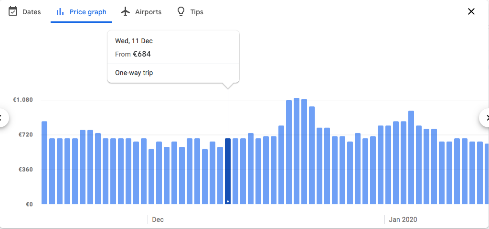
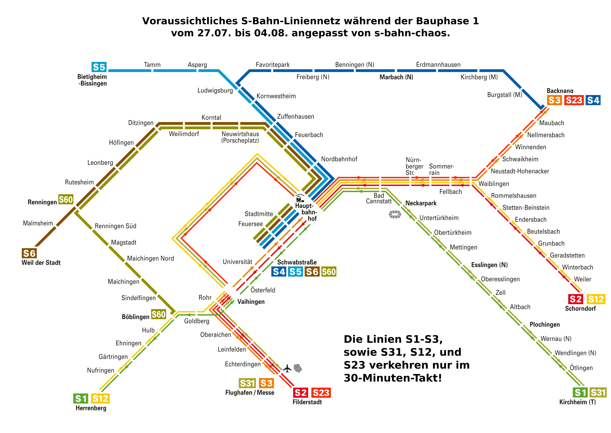
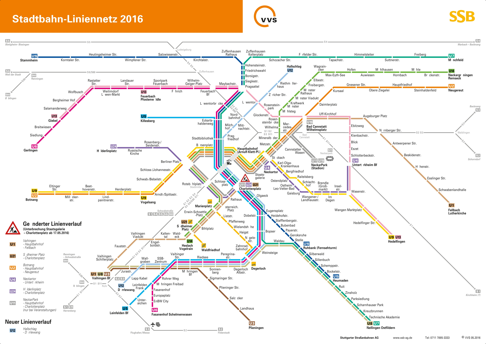
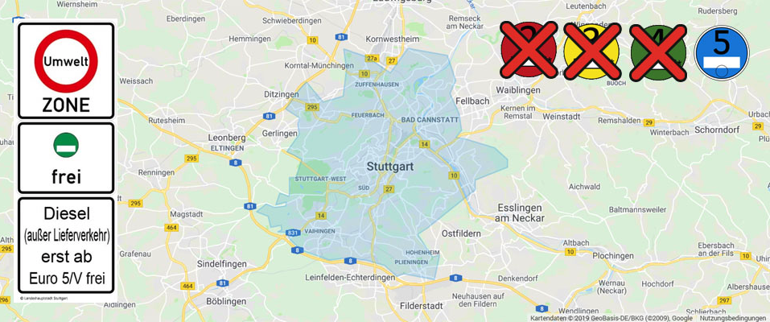

<!-- toc -->
# A SMALL GUIDE TO SETTLE DOWN IN STUTTGART AS UBC STUDENT

Hallo! Welcome to this .git page. In this repository, UBC students will explain everything needed to settle into Stuttgart and Bosch!
Please note this page is simply advice based on our experiences. Not all information may be accurate despite our efforts to make it so. 

If you are currently in Stuttgart and would like to update this page, please xyz.

## Table of Contents  
<ul>
<li> <a href="#leaving_ubc">1. Leaving UBC</a>
 <ul>
  <li> <a href="#insurance">1.1 Insurance </a>
  <ul>
   <li> <a href="#ams"> 1.1.1 Qualifying for AMS Student Care </a> </li>
   <li> <a href="#leaving_ubc_else"> 1.1.2 Other Options </a> </li>
   </ul>
  <li> <a href="#visa">1.2  Visa </a>
  <ul>
   <li> <a href="#us_citizens"> 1.2.1 US Citizens </a></li>
  </ul>
  <li> <a href="#looking_for_house"> 1.3 Looking for housing before arriving </a> </li>
  <li> <a href="#plane_tickets"> 1.4 Plane Tickets/Preparing for departure </a></li>
 </ul>
 <li> <a href="#settling_stuttgart"> 2. Settling Down in Stuttgart </a> 
  <ul>
   <li> <a href="#find_place"> 2.1 Find a place</a>
    <ul>
     <li> <a href="#air_bnb"> 2.1.1 Airbnb </a> </li>
     <li> <a href = "#stuttgart_lonberg"> 2.1.2 Stuttgart and other areas </a> </li>
     <li> <a href = "#renting"> 2.1.3 Renting </a> 
     <ul>
      <li> <a href = "#house_registration"> Housing registration </a> </li>
     </ul>
     </li>
     </ul>
   </li>
   <li> <a href = "#commuting"> 2.2 Commuting </a>
    <ul>
     <li> <a href = "#city_link"> 2.2.1 City-Link </a></li>
     <li> <a href = "#spltr"> 2.2.2 SPLTr </a></li>
     <li> <a href = "#s_bahn"> 2.2.3 S-Bahn/U-Bahn</a></li>
     <li> <a href = "#driving"> 2.2.4 Driving (Diesel)</a></li>
    </ul>
   </li>
   <li> <a href = "#bank"> 2.3 Bank </a>
    <ul>
     <li> <a href = "#bank_2"> 2.3.1 Go to Deutsche Bank </a></li>
     <li> <a href = "#other_banks"> 2.3.2 Other Banks</a></li>
    </ul>
   </li>
   <li><a href = "#phoneplan"> 2.4 Phone Plan</a>
    <ul>
     <li><a href = "#pre_paid"> 2.4.1 Pre-paid </a> </li>
     <li><a href = "#best_companies"> 2.4.2 Best companies</a></li>
    </ul>
   </li>
  </ul>
 </li>
 <li><a href = "#work_environment"> 3. Bosch Work Environment</a>
  <ul>
   <li><a href = "#getting_paid"> 3.1 Getting paid at Bosch </a></li>
   <li><a href = "#food"> 3.2 Food - Intern Discount</a></li>
   <li><a href = "#flex_time"> 3.3 Flex time/Vacation</a></li>
   <li><a href = "#dress_code"> 3.4 Dressing like a Bosch</a></li>
  </ul>
  </li>
 <li> <a href = "#learning_german"> 4. Learning German</a>
  <ul>
   <li><a href = "#learning_german_why"> 4.1 Why?</a></li>
   <li><a href = "#tools_and_resources"> 4.2 Helpful tools and resources</a></li>
  </ul>
 </li>
 <li><a href = "#life_in_stuttgart"> 5. Life in Stuttgart</a>
  <ul>
   <li><a href = "#parties"> 5.1 Parties</a></li>
   <li><a href = "#hikes"> 5.2 Hikes</a></li>
   <li><a href = "#travels"> 5.3 Travel, etc…</a></li>
   <li><a href = "#expats_stuttgart"> 5.4 Expats in Stuttgart FB group</a></li>
  </ul>
 </li>
 <li><a href = "#bonus"> 6. Bonus: Like a bOsCh</a></li>
 </ul>
 </li>
 </ul>
 
<h2 id="leaving_ubc"> 1. Leaving UBC</h2>
 
<h3 id="insurance"> 1.1 Insurance </h3>
  
You need health insurance to live and work in Germany. If you're a non-EU citizen, this is a crucial component of applying for your residence permit, which allows you to work in Germany.

<h4 id="ams"> 1.1.1 Qualifying for AMS Student Care </h4>

AMS Student Care health insurance coverage is part of your student fees at UBC. Part of this coverage includes travel health insurance. However, this health insurance is only active (regardless of if you paid for it with your co-op tuition) if you are paying for MSP (provided by the providence of British Columbia) or a similar basic private health insurance for BC.

You only qualify for MSP if you are living as a residence in BC. If you leave BC for up to 6 months, this is ok. You can continue to pay for MSP online and you will still qualify for the travel health insurance with AMS Student Care. If you are away from BC for longer than 6 months, you will need to purchase basic private health insurance for BC in order to qualify for the travel health insurance with AMS Student Care once you are gone for longer than 6 months.

<h4 id="leaving_ubc_else"> 1.1.2 Other Options </h4>

If you receive healthcare through a family member such as a parent or guardian, you can speak with them to see if you will be covered overseas for the duration of your stay. One example of healthcare that can apply overseas is Pacific Blue Cross. 

<h3 id="visa"> 1.2 Visa </h3>

<h4 id="us_citizens"> 1.2.1 US citizens </h4> 

As a US citizen, you have two options to apply for your visa:

<b>Option One:</b> 
Before moving to Germany, schedule an appointment with the Toronto German Consulate, and fly to Toronto with all the required documentation for your visa application. You will need x,x,x,x,x, and x (to be edited soon). The German Consulate will process your information and hold onto your passport until you are issued your visa. This typically takes a few days, unless there are issues with your application. This option is the best for ensuring you can begin your work term at Bosch on time.

NOTE: Scheduling an appointment early with the Toronto German Consulate is key. Appointments book quickly and you may end up having to leave UBC during exams and end of term to take care of your visa. This can be extra stressful and not fun. So save yourself the stress and book it early.

NOTE: Ok. I'm a US citizen though. Why do I need to go all the way to Toronto to apply for a visa? The simplest answer is that this is the way the German government decided to set up their consulates. You must apply for visas and permits in your country of residence (most likely Canada) and not your country of citizenship. Not all consulates process visa and permit applications (Vancouver's consulate does not), so Toronto is where you gotta go. This is your first taste of German bureaucracy - hold on tight, it's gonna be a wild ride.

<b>Option Two:</b> 
Arrive in Germany at least a month before you are scheduled to begin your work term at Bosch. As a US citizen, you can reside in Germany for up to 90 days without a visa. Upon arriving, immediately contact the Ausländerbehörde (aka the Foreigners Authority) to set up an appointment for your residence application. There is a specific phone number you can call based on your last name or you can submit an email requesting an appointment. To find this number and more information about setting up an appointment, visit <a href="https://www.stuttgart.de/item/show/318412">this</a> website. It is incredibly important when you request an appointment that you stress the time sensitivity of your situation. Include that you are a US citizen, a student trying to start an internship, and when you are scheduled to start employment. Typically, appointments can take months to schedule. But by pleading your case in your first communications, they will usually work to schedule your appointment within a month.

Once you have an appointment scheduled, you will receive a list of documents to submit. These may include:
<ul>
 <li>Antragsformular (application form),</li> 
 <li>Praktikumsvertrag (employment contract),</li>
 <li>Zustimmung der Agentur für Arbeit (ZAV) (approval from the employment agency),</li> 
 <li>aktueller Wohnraumnachweis vom Eigentümer unterzeichnet und Kopie Mietvertrag (your housing certificate signed by the person owning the property and your rental contract),</li> 
 <li>and aktueller Krankenversicherungsnachweis (proof of health insurance coverage in Germany).</li>
 </ul>

Typically, you will be asked to submit these documents via email prior to your appointment date.

NOTE: Make sure your employment contract lists the correct start and end dates of your work term. Bosch is responsible for obtaining approval from the employment agency. This approval is only granted for the dates within your work contract and therefore your residence permit is only granted for the dates within your work contract.

NOTE: The proof of health insurance coverage in Germany can be difficult to obtain. In some cases, you may need to have your insurance company sign a form. Once you receive the form from the German authorities, immediately begin the process of contacting your insurance to sign the form. Without the signed form, they will not grant you a residence permit regardless of the other documentation you provide to prove your health insurance.

To the appointment, bring with you:
<ul>
 <li>a printed version of the documents you were asked to submit if possible,</li>
your passport, 
 <li>two biometric photos (the restrictions for these photos can be found <a href="https://www.schengenvisainfo.com/photo-requirements/">here</a>),</li>
 <li>and the fee for the permit.</li>
</ul>

<h3 id="looking_for_house"> 1.3 Looking for housing before arriving </h3>

From our experience, it is very hard to look for a housing if you're not present in Germany (and don't speak German). This is because you cannot visit the apartement before paying for the deposit. So, there will be a trade off: go throught an agency and pay more for what you get, or do it on your own and risk to be scammed. Both options will be discussed in <a href="#find_place">[2.1 Find a place]</a>. Our recommendation would be to fly to Stuttgart and stay there a week to look/visit rooms and apartments.  

<h3 id="plane_tickets"> 1.4 Plane Tickets/Preparing for departure </h3>

Vancouver-Stuttgart (<b>ONE WAY</b>) usually cost between €650-€1500 ($950-$2200 CAD) depending on when how late you buy the plane tickets. We recommend you to buy them as soon as you know your final dates. 

flight cost according to Google Flights:

<h2 id="settling_stuttgart"> 2. Settling Down in Stuttgart </h2>

Arriving in Stuttgart can be stressful. Most of us are not Europeans and don’t speak German (yet!). This section contains tips and resources to help you ease into German life with minimal issues. For some of us, it took a whole stressful month to settle down - avoid this by reading these sections. We recommend arriving in Stuttgart one to two weeks before your internship starts. This allows you time to find housing, establish a bank account, and set-up a German phone number. 

<h3 id="find_place"> 2.1 Find a place </h3>

Before you begin looking for a place to stay, get familiar with your commute and transportation options to Bosch and around Stuttgart (Refer to section <a href="#commuting"> 2.2</a>).
This will help you establish what areas of town you want to look for housing in. It is encouraged to house hunt in-person instead of from the Canada. Scams can happen, but are much less likely if you are able to visit a place in-person before signing anything. 

For example, we visited an attractive place in Renningen mid-May, just to learn during the visit that the rental period began in early August.
 

<h4 id="air_bnb"> 2.1.1 Airbnb </h4>

Airbnb is a great resource to quickly find a transition place until you get an apartment or more permanent room. Hosts are usually incredibly kind and can be willing to help you out with language translations/housing registration/etc. You can get familiar with the city without stressing over accommodations. 

<h4 id="stuttgart_lonberg"> 2.1.2 Stuttgart and other areas </h4>

Living in and around Stuttgart can be expensive. More than half of our salary can go for rent if we're not careful. Places near downtown (Stadmitte) are EXTREMELY expensive. Renningen, the town closest to Bosch’s campus, is a great location. Unfortunately, housing is very expensive there too. This is due to two main economic factors: the Bosch campus (1200 employees) and the American military base. Many people are moving in and out of Renningen regularly causing rents to skyrocket. 

We recommend Leonburg due to its environment and location. A place near Wie-der-Stadt, an S-bahn station two stops away from Renningen, is also a good option.

  
<h4 id="renting"> 2.1.3 Renting </h4>

Finding a place to live in Stuttgart when you’re 5000km away can be quite challenging. Where to start? Who to contact? How? We’ll try to answer these questions in this section. 

<h5> Student Housing </h5>

Student dorms is a very cheap option. However, they are also extremely difficult to get. Check out <a href="https://www.studierendenwerk-stuttgart.de/en/accommodation/">this</a> website for more information, listings, and applications. There are a number of dorms around Stuttgart city centre and in other cities like Ludwigsberg. You must apply online. Although it says applications should be made 6 months in advance, there is still hope if you’re looking for housing in the middle of the semester (i.e. January). After applying online, email them and sound as desperate as possible. Email address can be found in the contact section of the website. Email address of Neckarstasse 172 : ADD HERE. This has been successful for a few of us so far. If you are in Germany, go to their office and talk to them. Office address: ADD HERE.

Pros:
<ul>
 <li>Cheaper than anything else in Stuttgart. Prices range from 230€ - 400€ including utilities</li>
<li>Usually have large communal kitchens. This can be the best place to throw parties and play beer pong</li>
 <li>Everyone living here is a student, so you get invited to parties and meet new people</li>
 <li>Safe</li>
 <li>Don't have to deal with landlords</li>
 <li>All the locations are near the city centre</li>
 </ul>

Cons:
<ul>
 <li>You will have to share the kitchen and the bathroom with 5-8 other roommates</li>
 <li>Rooms are small</li>
<li>You can only rent for 6 months (Some of us have had luck renting for longer by going to the office and talking to them)</li>

<h5> Bosch Housing </h5>

Bosch sent you a list of <i> available accomodations </i> in your contract... in German. But hey... it still helps and is a great place to start.

<h5> Own Apartment </h5>

Renting your own studio is awesome. You don’t have to share your kitchen and shower with roommates. You don’t have quiet hours. YOU CAN BE FREEEEEEEEE! However, it can quickly become expensive and… our small salary won’t make it to the end of the month. 
There are two options when you look for your own studio/room. Option one: look on sites such as the German <i><a href="https://www.wg-gesucht.de/">craiglist</a></i> and <i><a href="https://www.uniplaces.com/">Uniplaces</a></i>. Option two: hire an agency to do the scouting for you.

In any case, visit the apartments/houses IN-PERSON before signing a rental contract and/or a paying deposit... for many reasons we’ll explain in a section below [link to section].

<h6> Rental Agencies </h6>

One might think that contacting an agency would be a good move… and one is right. Agencies are a good resource to help you find a reliable place. They have quality standards and are only renting places where they have a contract with the owner.  

<b> Pros: </b>
<li> <b> Speaks English </b> - The communication can be easily done in English. The person will ask you what you are looking for, your price ranges, and expectations. They will then send you offers that fits your needs. </li>
<li> <b> Quality Assurance </b>- The apartment offered through an agency will be clean and quality. They cannot falsely advertise. If an apartment looks decent online, it’s probably worth visiting. </li>
<li> <b> Reliable </b> - The rental dates, the rental price, etc… What you see in the online ad will be accurate. Therefore, you have little chance of visiting an apartment that will only be available two months after your visit. </li>
<li> <b> Payment </b> - You will pay rent directly to the agency. The agency then pays the landlord. This limits your chances of being scammed (More details in the “Do it yourself” section [link to paragraph]).  </li>
 
<b> Cons: </b> 
  
<li> <b> Expensive </b> - The general rule is that you’ll lose 2-3 months of rent a year. In other words, if you decide to rent an apartment with an agency, they’ll increase the prices so they can profit of 2-3 extra months worth of rent.  </li>
<li> <b> Deposit </b> - Once you sign a rental agreement, you’ll need to pay a deposit and the first month of rent before you move in. Be prepared to have enough money to pay the deposit and first month before you get your first Bosch paycheck.  </li>
<li> <b> Paperwork </b> - The agency will want proof you’ll be able to pay rent for the full extent of your internship (+ proof of visa/identity). Why is that? In Europe, removing tenants is incredibly difficult, even if the tenants are refusing to pay their rent. The process of evicting a tenant takes 1-2 months. A rental agency wants to prevent a situation where they enter a rental contract with someone who stops paying rent after a few months. While the paperwork is a hassle, it protects both the tenant and the landlord.</li>
<li> <b> Online </b> - Most rental agencies operate online and through emails. They do not encourage meeting in-person to discuss your needs and expectations.</li>
 
Link to some agencies: 
<li> <a href="https://www.hc24.de/en/furnished-living-space-in-stuttgart.htm">[HC24] </a></li>
<li> <a href="https://www.homecompany.de/de/index"> [Home Company - Online only] </a></li>
 
BONUS: <a href="https://www.toytowngermany.com/forum/topic/372037-tenant-refuses-to-pay-rentquick-resolution/"> Europe is crazy </a>

<h6> "Do it Yourself" </h6>
 
Link to websites: 
<li><a href="https://www.wg-gesucht.de/">[WG-GESUCHT] </a></li>
<li><a href="https://www.immobilienscout24.de/"> [Immobilienscout24 - closest equivalent to craiglist] </a></li>
 
<h5 id="house_registration"> Housing registration </h5>

Once you’ve found a place to live, signed a rental agreement, and paid your deposit, it’s time to register your housing. Regardless of if you’re a German citizen or an international citizen, everyone must register their place of residence within Germany. To register, bring your passport and signed rental contract to your closest Rathaus (civil office - kind of like a city hall). By completing your housing registration, you’ll also receive an Identifikationsnummer (the German version of a Canadain SIN or an American SSN) in the snailmail. See section X for why this is important. If you don’t receive your Identifikationsnummer in a timely manner, you can pay the Rathaus another visit and directly request it. They should be able to print it out for you on the spot if your housing registration was completed during an earlier visit. 

NOTE: Before leaving Germany, don’t forget to deregister! 

<h3 id="commuting"> 2.2 Commuting </h3>

Commuting to work may be the parameter that will impact your life most in Germany. Would you rather spend 30 minutes or an hour and 30 minutes commuting? The condition in which you commute is also important. Would you rather have an hour long bus ride with wifi or an hour and 30 minutes of commuting with 3 train transfers and no wifi nor AC. This section is here to help you understand how you can travel around Stuttgart easily and travel to Bosch with minimal energy and time.

<h4 id = "city_link"> 2.2.1 City-Link </h4>

The City-Link will be your favourite resource! 

City-Link is a free bus line offered by Bosch, picking up from downtown Stuttgart (at Rotebühlplatz and Swartzstraße), and delivering you directly to the Renningen campus.

If you don’t want to spend 300€ on a student travel pass (similar to Vancouver’s Compass card) and still live in downtown Stuttgart, this is the way to go.
 

PROS: 
<li> Free </li>
<li> Fast (40 min from Downtown to Renningen) </li>
<li> Wifi + AC </li>
<li> Several buses per the day </li> 
CONS:   
 <&#39none>   
 
NOTE: You won’t be able to take the City-Link to get to work on your first day. You must have your Bosch ID card to board the bus, so plan an alternative transportation method. 
 
NOTE 2: You will not be able to find any information about the City-Link online. This is a service we usually learn about when we arrive. However, we believe it should be known beforehand as it would have changed our house hunting plans.
<a href="https://www.instagram.com/klingelreisen/p/BpFZSM1nGyR/"> City-Link-beautiful-picture-found-online </a>

NOTE 3: We only know about the Bosch Renningen City-Link, but we bet other Bosch campus locations will have something similar. Feel free to try to contact other interns at other locations to ask. If it exists, please contact me so I can edit the document. 

<h4 id="splr"> 2.2.2 SPLTr </h4>

SPTLr is another resource from Bosch to help employees to commute to work. SPTLr is a car share app that allows anyone using it to either register as a river or a guest. The app connects employees living in remote areas to commute together in order to reduce the costs (and their carbon footprint). The app is relatively new and still needs improvement. However this can still be a resource worth looking into. 

PROS:
<li> Car share: You can register as a driver to reduce your expenses or guest to join a driver. </li>
<li> Locations: Public transportation can be annoying from time to time. This car share system can be more tailored to your location for convenience. </li>
<li> Social: You may end up practicing your German during your commute, or connecting with someone you may have never otherwise met. </li>
<li> Money: As a guest you pay the driver and as a driver, you receive payment. This is all carried out in the app, making it easy to calculate costs based on distances. </li> 

CONS: 
<li> Users: Not many  </li>
<li> App: The app is new and its design isn't the most intuitive </li>
<li> Registration: This requires a Bosch email address. You can register for it only after starting work
 </li> 

SPLTr will probably become one of the best commuting car sharing apps for the Bosch community. However, we would not recommend on relying on it when house hunting.

<h4 id="s_bahn"> 2.2.3 S-Bahn/U-Bahn </h4>

U-Bahns and S-Bahns (basically subways) make up Stuttgart’s public transportation system, along with a few buses. U-bahns are typically shorter, smaller trains while S-Bahns are bigger and travel further distances.

The S-Bahn transport map: 
 

The U-Bahn transport map: 
 

It’s important to know that the cost to travel in zone one. If you purchase your ticket at a train station, traveling within zone one will cost 2.50€. If you purchase it from the VVS or SSB smartphone app, it will cost 2.37€. The app requires internet to make the ticket purchase and a credit card. Once you have purchased the ticket, you no longer need internet. 

The cost to travel to Renningen from Stadtmitte (downtown Stuttgart) is ~5.50€ (~11.00€ for a two-way trip). The cheapest option to commute to Bosch is to travel in zone one to either Rotebühlplatz or Swartzstraße, and then take the City-Link.

The student card is like a UPass in Vancouver. It costs 300€ for 6 months and covers 6 zones. This means you can use the UBahn and the SBahn for anywhere in the greater Stuttgart area. However, there is a caveat. The student pass is only valid from <b>October to March</b> or <b>April to October</b>. So, if you arrive to Stuttgart in January and your work term lasts eight months, you’ll need to buy 2 student passes.
If you are using the City-Link (which you should), then you can buy the monthly passes for particular zones.

<h4 id="driving"> 2.2.4 Driving </h4>

For thoses are tempted to use a car around Stuttgart there are few things you need to know. It can be worth it to have a car for many reasons: cheaper commute, you can be a driver on SPLTr, you can easily travel to the Black Forest and the rest of Europe, you can take holidays with other interns, and live closer to work. However, Germany has some STRICT environmental restrictions regarding diesel cars allowed in certain areas.

Some diesel cars are not allowed to drive in certain zones. The fine for doing so is 80€. The restrictions are in place to increase air quality and are based on how the car engine burns fuel, emitting particles.

<b> IMPORTANT NOTE: The restriction is ONLY for cars with diesel engines. Gasoline cars can drive freely no matter how fuel efficient they are.</b>

Currently the only diesel cars allowed to drive in Stuttgart and Leonberg are those with a EURO-class of 5 or more, however the change from "class 4" to "class 5" is relatively new so there is a transition period (I am currently driving an EURO-class 4 and do not have problems with it). For the sake of the environment we'll highly recommend anyone who plans on buying/renting/using a car in this area to follow the environmental norms.

If you are driving a diesel car, you will need a Umwelt-Plakette. You can buy them at any car retail store (7€) or any civil office (aka Rathaus). You will need to bring your car papers with your driving license to obtain the Umwelt-Plakette.

Info: 
 
[Umwelt Plakette Website](https://www.umwelt-plakette.de/en/information-about-german-environmental-badge/environmental-zones-in-germany/german-environmental-zones.html)
 
[Stuttart Info](https://www.umwelt-plakette.de/en/information-about-german-environmental-badge/environmental-zones-in-germany/german-environmental-zones/stuttgart.html)
 
[Green-Zone EU app](https://www.green-zones.eu/en/info-apps/information-offers/the-green-zones-app.html)
 

<b> IMPORTANT NOTE: The english website says that EURO-class 4 are allowed in Stuttgart, however, this was changed. From April 1st, 2019, only EURO-class 5 and higher are allowed. </b> 

<h3 id= "bank"> 2.3 Bank</h3>

You need to open a German bank account to get paid. No, you cannot use your Canadain/US/French account instead. Banking in German is a bit different than in Canada. There’s no Interac Transfer and the process is a bit more complicated (i.e. more paperwork). Below are some options with the pros and cons that we’ve learned along the way.

<h4 id="bank_2"> 2.3.1 Deutsche Bank </h4>

<h5> Opening an Account </h5>

While working at Bosch, you can open a Deutsche Bank account for free. Make an appointment online or via phone at a branch close to you. Make sure to bring along your passport, Bosch work contract, and residence registration to the appointment. In roughly 2 meetings with an advisor, you can have a fully working bank account with a debit card ordered.

<b>NOTE:</b> If you’re a US citizen, you’ll also need your SSN and will be asked to fill out a tax form for the US government. Ask to fill out this form during the appointment. You won’t need to go through the hassle of printing the form, mailing it in or stopping by the specific bank branch again.

<h5> Pros with Deutsche Bank</h5>
<li>Their customer service is top notch.</li>
<li>You can withdraw cash from ATMs around Europe without fees at select banks. You can also withdraw cash from your ScotiaBank account without fees from Deutsche Bank ATMs (regardless of if you have an account with Deutsche Bank).</li>
<li>Online banking. Their phone app is efficient and they’ll help you set everything up in-person if you request a meeting.</li>
 
<h4 id="other_banks"> 2.3.2 Other Banks </h4> 
<h5> N26 </h5>

 N26 offers an easy to set-up bank account, designed specifically for international people settling down for the first time in Germany. To set up the account, you need to fill in the online registration form, then complete their online ID verification which will require your passport, and then pair your smartphone to your account. N26 has no physical branch, so everything is done online. 

<h5> Pros with N26</h5>
<li>Their set up is incredibly easy.</li>
<li>You can withdraw cash from all ATMs which accept mastercard.</li>
<li>Online banking. Their phone app is efficient and can be used for all banking needs.</li>
<li>You can withdraw cash from supermarkets and other vendors with a QR code</li>

<h5> Cons with N26</h5>
<li>Depending on the account, you only get 5 ATM withdrawals in Germany per month for free, any German ATM withdrawals after this will be charged.</li>
<li>You can only deposit cash through a supermarket or vendor.</li>

<h5> Commerzbank </h5>

From our experiences, Commerzbank is very frustrating to open an account with. While you can try and open an account online without an appointment, you will end up having to prove your identity (bring your passport) at a PostBank or in-person unless you’re a German citizen. If they need to send you your ATM card more than once, they will charge you 5€ each time they send it. They will also charge you when they send you correspondence through the mail. 

If you feel the need to open an account with Commerzbank here are some tips so hopefully you don’t get ripped off:
<li> Be prepared to provide an address where you can receive mail at and you are registered with the German authorities. This is how you receive your ATM card. In Germany, mail is delivered based on the name on the postbox. If you’re name is not on the postbox, provide a care-of (CO) name that is on the postbox along with the address </li>
<li> As soon as you have access to your online banking, opt out of receiving mail through the post. This means they will send you correspondence online and won’t charge you for it </li>

<h3 id="phoneplan"> 2.4 Phone Plan </h3>

Phone service is not available on Renningen Campus for most compagnies!! Most people have to go outside campus to find service. Vodaphone, however, works and even provides 3G. 

<h4 id="pre_paid"> 2.4.1 Pre-paid OR Phone plan</h4>

Unless you’re planning to stay in Germany for two or more years, you’ll need a pre-paid phone card. With your passport, you can purchase a pre-paid SIM card. Below, we recommend a few companies we’ve had experience with.

<h4 id="best_companies"> 2.4.2 Best companies </h4>

Please be carefull with using your phone outside Germany (Italy, France, Poland, etc...) as it might be crediting you for any data/texts send. I spend 2 weeks outside Germany and got credited 50€ without knowing for using my data. If you ever decide to go for an 'international EU plan', please remember that some countries (Monaco, Switzerland, etc...) are not EU members and fees can apply! 

<h5> O2 </h5>
 
At the time of writing this, O2 offers pre-paid cards with limited calls and texts, and various amounts of data (3GB is about 15€ a month). These plans are nice because you’ll have phone service and data in Germany and any other EU country if you’re planning to travel. Once you have a German bank account, you can easily pay for your next month of service by texting 56656 from your phone with the O2 phone number. This number will send you information to transfer money. You can then ensure the money was transferred by checking your online O2 account. On O2's <a href="www.o2online.de">website</a>, go to Mein O2 -> login to your account -> Guthaben und Aufladen -> Guthabendetails -> Aufladungen und Abbuchungen. This page should provide you with a history of the transactions on your account. Transfers may take several days (yay for the German banking system), so check with your bank to ensure the transfer was processed if you don’t see the payment on your O2 account.

NOTE: O2 offers a smartphone app. It boasts a lot of features and convenience - like paying for your service, checking the remaining amount of data you have, etc. Unfortunately, you can only download it to your Apple device if you’re Apple account location is set to Germany. This is very hard to do it you have a foreign credit card linked to your Apple account.

<h5> Vodafone </h5>

This is also a good option since it works on the Renningen campus. You can have 2GB Data with unlimited texting for 10€ a month. When your 2GB of 'High Speed Data', you'll still be able to access 'low speed data (E)'. 

  
<h2 id="work_environment"> 3. Bosch Work Environment </h2>

<h3 id="getting_paid"> 3.1 Getting Paid at Bosch </h3>

 The first day of work your supervisor will send you an “intern welcome” email. In this email, there will be a link to a form that you NEED to submit to HR as soon as possible in order to get paid. PLEASE FILL THE GERMAN FORM. THE ENGLISH FORM WILL NOT BE ACCEPTED BY HR AND YOU WON’T BE PAID. This form will ask you for your Identifikationsnummer. See section X for how to get your hands on this very important 11-digit number.  Why is this Identifikationsnummer important? Part of it refers to your tax class. In Germany, there are different tax classes, and without a tax number provided by the Rathaus you’ll be charged at the highest rate. And yeah… losing 120€ at the end of your first month isn’t the most pleasant experience. So please, make sure you are prepared with your Identifikationsnummer. 

<b>IMPORTANT:</b> They will only pay you after your first full month. If you begin work at Bosch September 15th, you will get paid at the end of October for a month and a half of work.  Avoid making this mistake and begging them for money (#notfun).

<h3 id="food"> 3.2 Food - Intern Discount </h3>

Don’t worry about bringing lunch with you. At Renningen, there is a cafeteria where everyone eats. It’s open weekdays from 11:30-14:30. As an intern, you receive a discount of X.XX€ on every meal. Depending on what you choose to eat, you typically spend 1.30€ to 5€ per meal. You pay for food with your Bosch ID card. Your balance can be refilled with cash at the kiosk directly outside the cafeteria.  

<h4>Cafe</h4>

There’s also a cafe on campus where you can purchase breakfast, lunch and snacks. Sadly, no discounts are available for interns here but you can use cash and your Bosch card for purchases. 

<h4>Coffee and Snacks</h4>

There’s free coffee, milk and sugar in your office! You can make yourself espresso or coffee crema. Be prepared to have the machine notify you German to refill the water tank or dispose of the coffee grinds every once in a while. There’s also coffee machines where you can get fancy coffee by paying with your Bosch card. Vending machines around campus offer snacks for purchase with your Bosch card as well. These vending machines can also be used to check your balance on your Bosch card before heading to the caf for lunch. 

<h4> Fun fact </h4>

If ever you forget to lock your computer at work and someone sees it, they'll send an email to the whole floor saying you will bring cake. And yes, you’ll be held accountable to bring in cake. Yeah... don't forget to lock your computer or you'll have to bring cake for everyone!

<h3 id="flex_time"> 3.3 Flex time/Vacation </h3>

Each day, you are expected to work 7 hours and take 45 minutes for lunch and breaks. Due to German law, you may not work longer than 10 hours. Your working time is tracked when you tap your card upon arrival to Bosch and when you tap out at the end of the day. You can find all of this documented in the your Time Management page within Bosch’s internal HR pages. You can also adjust your break time from 45 minutes to up to 1 hour. 

Flex time is the time management system employed by Bosch. In order to avoid paying interns for overtime, Bosch stores any hours you work beyond the required 7 hours. For example, one day you work 10 hours and take 45 minutes of breaks, then the next day you leave after working for 4 hours and taking 45 minutes of breaks. As long as the combined work time for the two days is 14 hours, you’re in the green. This also means that if you work 10h per day for four days, you can have a 3-day weekend by using your flex time instead of your vacation time! In the Time Management page, when you take a day off of work, you create an entry and specify if the time off is vacation or flex-time. 

Depending on the length of your internship, you’ll receive some vacation days which can be found in your contract.

<h3 id="dress_code"> 3.4 Dressing like a Bosch </h3>
 
Expect business casual, with an emphasis on casual. While some colleagues will dress up daily (think button-down shirts with dress pants and leather shoes), it is ok to wear jeans and a t-shirt. If you’re working in a clean room, you must wear pants or shorts to work, with closed toed shoes.

<h2 id="learning_german"> 4. Learning German </h2>

<h3 id="learning_german_why"> 4.1 Why? </h3>

You don’t need to learn German to perform well at Bosch. But boy, oh boy, it will enrich your experience and time in Germany immensely. It will take time, energy, and extra effort. However, you will learn to think differently and connect with others in ways you may not be able to in English. (e.g. A classical reading of Rammstein by Tom Walther)

<h3 id="tools_and_resources"> 4.2 Helpful tools and resources </h3>

There are many resources out there to aid you in learning German if you’re interested. Find stuff that works for your brain and you enjoy doing on a daily basis. Below are a few resources we’ve found to be helpful.

<ul>
 <li> <b> Duolingo </b>
  <ul>
   <li> Great for getting started and building a foundation of the language. Best if used daily. At first, it can seem silly and childish. But as you advance, you can start to recognize patterns in the language and it can become a powerful tool.
   </li>
  </ul>
 </li>
 <li> <b> Google Translate </b>
  <ul>
   <li>Great when you really need a quick translation. You can download languages to your phone, translate text directly from photos and more. 
   </li>
  </ul>
 </li>
 <li> <b> Podcasts </b>
  <ul>
   <li>There are a lot of podcasts out there trying to teach you German. Below are a few that have been worth a listen that can be found through Apple Podcasts and other platforms.
   </li>
  <li> Slow German mit Annik Ruben: <a href= "https://slowgerman.com/"> link here </a>
   <ul>
    <li> This one is exactly what the title sounds like. Episodes are usually 10-15 minutes long. Annik talks 100% in German, slowly. A complete transcript can be found in the episode description, making it easy to follow along and pick out words you want to review later. Episodes are typically about German culture, history or geography. When first starting out, don’t worry about understanding every word. Listen and read for words you recognize. Try and learn new words from the context of the episode. 
    </li>
  </ul>
 </li>
 <li> Coffee Break German: <a href= "https://radiolingua.com/category/coffee-break-german/"> link here </a>
  <ul>
   <li>Mostly in English, this podcast will explain grammar rules and teach you new German vocabulary. It also invites you to practice speaking aloud and recall phrases from previous episodes.</li></ul></li>
   </li>
  </ul>
 <li> <b> TV shows </b>
  <ul>
   <li>Great for immersing yourself into the German language and culture. You can play most shows with English or German subtitles while listening in German. The shows below can be found on Netflix.
    <ul>
     <li> Dark </li>
     <li> How to Sell Drugs Online (Fast) </li>
     <li> Babylon Berlin </li>
    </ul>
   </li>
  </ul>
 </li>
 <li> <b> Native German speakers </b>
  <ul>
   <li>Most Germans appreciate others who are working to learn German. Reach out to your new colleagues and friends for help with pronunciations and translations. Practice speaking with them and ask for feedback. 
   </li>
  </ul>
 </li>
</ul>

<h2 id="life_in_stuttgart"> 5. Life in Stuttgart </h2>

<h3 id="parties"> 5.1 Parties </h3>

There is no parties in Germany. OH WAIT, you ask us about THE OKTOBERFEST? or THE STUTTGART BEER FESTIVAL (twice a year <a href="https://www.wasen.de"> here is the countdown </a> )? OR THE EVERY WEDNESDAY KARAOKE NIGHT (<a href="https://www.biddyearlys.com/biddys-karaoke-party">here</a>)? OR EVEN THE THURSDAY'S BEERPONG (<a href="https://white-noise.eu/programm/beer-pong-stuttgart-3-1/"> here... </a>)? And check out the night clubs out there, they are... interesting! 

<h3 id="hikes"> 5.2 Hikes </h3>

Stuttgart is on the edge of the Black forest. There you could do a different hike every day for a year and not be close to done with them (according to this <a href="https://www.outdooractive.com/en/hiking-trails/stuttgart-and-surroundings/hiking-trails-in-stuttgart-and-surroundings/1458162/"> website </a>: <b>"In total there are about 2,066 hiking trails for you to discover within the region of Stuttgart and surroundings"</b>). Forest is everywhere and renting a car for a day/weekend is recommended. 

Camping is slightly more difficult as the black forest is protected with strict laws. Wild camping is only allowed in few areas are allowed. (Damiano will talk about that soon). 

One hike that is highly recommended is in Bad Urach, a little town about an hour and a half away from Stuttgart by train. This is known for being a lovely little waterfall, with multiple path extending to different castles and in different directions. It can be quite cold here in Stuttgart depending on the time of year, so be well dressed for any conditions you find yourself in

Another place to go hiking is in the Black Forest. This is a wonderful forest that is quite near to the French border, and can offer 2 day long trails if you are into that sort of thing. Remember to bring proper outdoor gear such as tents, and food, and most important, as you are in a foreign country, LET SOMEONE KNOW WHAT YOU ARE DOING. If possible look into a satalite phone as it is quite possible that regular phone service wont work. 

<h3 id="travels"> 5.3 Travel, etc... </h3>

Wanna explore Milan? Head to Paris? Go for it! Here’s a few of our tips that we’ve learned through our experiences. 

<ul>
 <li>If traveling on a budget, look for hostels. Usually reasonably priced, you can get a bed and a place to shower, sometimes breakfast too. If you’re lucky, you may meet some fellow travelers and make some friends. Pro tip: most hostels have lockers to secure your stuff while you’re out exploring. Bring a lock with you to take advantage of this.</li>
 <li> Pack light. Most transportation options limit the number of bags you can take and their size and weight. Be aware of this or you may have to pay extra. </li>
 <li>Schedule your transportation and accommodations early. This may seem like a no-brainer, but you can save quite a bit moola with a little advanced planning. </li>
 <li> Planes, trains, and automobiles, oh my! There’s quite a few options to get around.
  <ul>
   <li>Planes - best for quick long distance travel throughout Europe. Schedule early if you can for the best deals</li>
   <li>Trains - good if you wanna see the land you’re passing through. Usually pretty comfty with plenty of legroom and space to sleep (and often wifi onboard).</li>
   <li>Buses - FlixBus is cheap. Can usually take about the same time as trains, but less comfy and sometimes cheaper. Be prepared for stops along the way, some delays, and random customs searches.</li>
   <li>Car-share services like BlaBlaCar </li>
  </ul>
 </li>
</ul>

<h3 id="expats_stuttgart"> 5.4 Expats in Stuttgart FB group </h3>

This group is a helpful resource and community. Comprised of mostly english speakers, you can pose questions to the group, join events, and meet other expats living in Stuttgart. Have a question about living in Germany? Ask it here. Often, there are events every weekend around town.

<h2 id="bonus"> 6. Bonus: Like a bOsCh </h2>

The BEST video you will ever see and... <a href="https://www.youtube.com/embed/v2kV6pgJxuo"> need </a>. 

   
  
 Collaboration: Sophia Gut, Alexandre Guichet, Mahdin Ar Rahman, Anand Samra, Rachit Kumar

 
